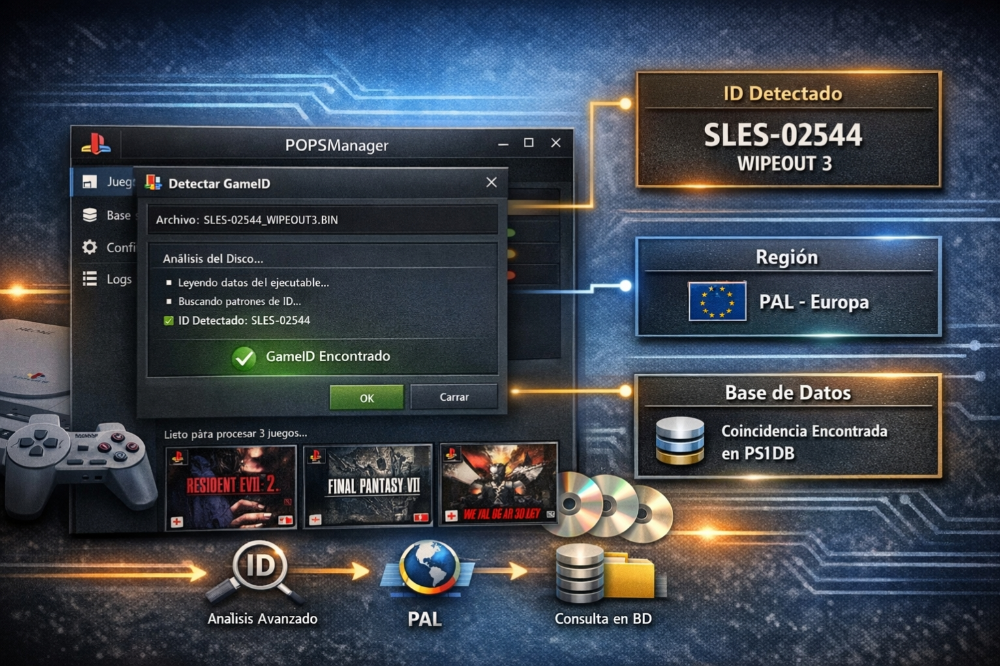
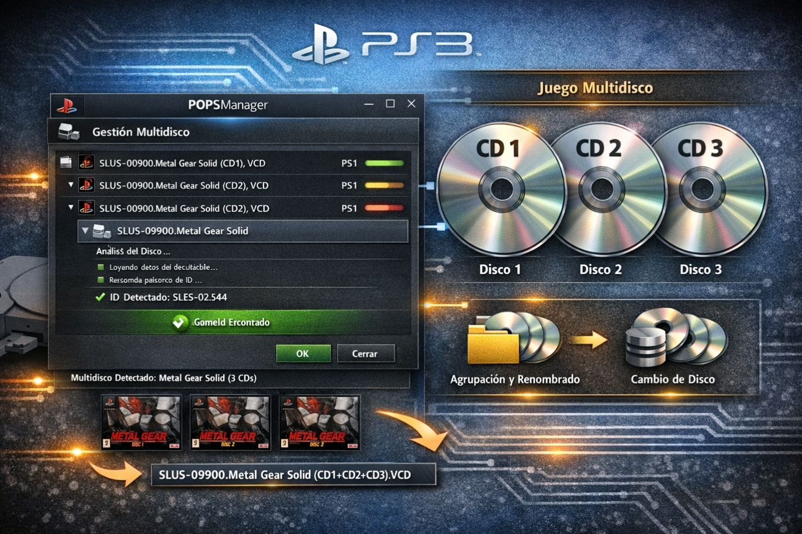

# POPSManager – Plataforma Profesional para Gestión de Juegos PS1/PS2

**POPSManager** es una herramienta modular, escalable y profesional diseñada para automatizar y optimizar el manejo de juegos de PlayStation 1 y PlayStation 2 en dispositivos OPL (Open PS2 Loader).

---

## 🎯 ¿Qué hace POPSManager?

POPSManager se encarga de **todo el proceso de preparación de juegos** para que puedas disfrutarlos en tu consola PlayStation 2 a través de OPL, sin necesidad de conocimientos técnicos avanzados. Sus tres pilares fundamentales son:

1. **Conversión de archivos BIN/CUE/ISO a formato VCD** (compatible con POPStarter).
2. **Procesamiento y organización automática** de juegos en la estructura de carpetas que OPL necesita.
3. **Configuración centralizada** para que el usuario defina sus rutas una sola vez y el programa trabaje con ellas.

---

## 🧠 Flujo de trabajo (Workflow)

### 📥 Entrada
El usuario proporciona una **carpeta de origen** con archivos de juegos (BIN, CUE, ISO, VCD). Estos archivos pueden estar sueltos o en subcarpetas (modo recursivo opcional).

### ⚙️ Procesamiento automático
Cuando se ejecuta "Procesar POPS", el programa realiza las siguientes tareas de forma secuencial y desatendida:

| Paso | Acción | Resultado |
|------|--------|-----------|
| 1. Detección de GameID | Analiza cada archivo para extraer el ID del juego (SLUS, SLES, etc.) | Identificación única del juego |
| 2. Limpieza de nombres | Normaliza los títulos eliminando etiquetas de región, idioma y formato | Nombre limpio en Title Case |
| 3. Validación de integridad | Comprueba que el VCD/ISO no esté corrupto | Seguridad en el procesamiento |
| 4. Agrupación multidisco | Detecta si un juego tiene varios discos y los organiza | Carpetas CD1, CD2, CD3... |
| 5. Copia a la estructura OPL | Coloca los archivos en POPS/ (PS1) o DVD/ (PS2) según corresponda | Estructura lista para la consola |
| 6. Generación de ELF | Crea el archivo ejecutable que POPStarter necesita | Arranque del juego |
| 7. Descarga de carátulas | Obtiene las imágenes ART desde la base de datos online | Carátulas en el menú de OPL |
| 8. Generación de CHEAT.TXT | Aplica fixes automáticos para juegos PAL | Mejora de compatibilidad |
| 9. Generación de DISCS.TXT | Crea el índice para juegos multidisco | Navegación entre discos |
| 10. Copia de recursos personalizados | Copia archivos de idioma (LNG) y temas (THM) si están configurados | Personalización completa |
| 11. Generación de metadatos (.cfg) | Crea archivos de información del juego (título, año, género, jugadores) | Información en el menú de OPL |

### 📤 Salida
Al finalizar, la carpeta de destino (raíz OPL) queda con la siguiente estructura:

Ruta OPL/
├── POPS/                    # Juegos de PS1
│   ├── Crash Bandicoot/
│   │   ├── CD1/
│   │   │   └── Crash Bandicoot (Disc 1).VCD
│   │   └── DISCS.TXT
│   └── Final Fantasy VII/
│       ├── CD1/
│       ├── CD2/
│       ├── CD3/
│       └── DISCS.TXT
├── DVD/                     # Juegos de PS2
│   └── God of War.ISO
├── CFG/                     # Metadatos de juegos
│   ├── SLUS_123.45.cfg
│   └── SCES_02105.cfg
├── ART/                     # Carátulas
│   ├── SLUS_123.45.ART
│   └── SCES_02105.ART
├── LNG/                     # Archivos de idioma (opcional)
├── THM/                     # Temas (opcional)
└── APPS/                    # ELFs de arranque
└── SLUS_123.45 - Crash Bandicoot.ELF.NTSC

---

## 🚀 Características Principales

### 🎯 Detección y Procesamiento
- **Detección automática de GameID** desde archivos VCD e ISO (PS1 y PS2).
- **Limpieza profesional de nombres** (Title Case, eliminación de etiquetas de región e idioma).
- **Soporte Multidisco** con detección, agrupación y renombrado inteligente.
- **Validación de integridad** de archivos VCD (header PSX, tamaño de sectores).
- **Base de datos híbrida** (local con archivos JSON + posibilidad de consulta online).

### 🎨 Interfaz Moderna y Multi‑Idioma
- **Interfaz WPF moderna, responsiva y escalable** (mínimo 800×600, inicio maximizado).
- **7 idiomas soportados** (Español, English, Français, Deutsch, Italiano, Português, 日本語).
- **Notificaciones visuales animadas** (éxito, error, advertencia, información).
- **Panel de progreso en tiempo real** para cada juego procesado.

### 🧠 Automatización Inteligente
- **Motor de automatización configurable** con 3 modos globales: Automático, Asistido (pregunta) y Manual.
- **Reglas independientes** para conversión, multidisco, carátulas, cheats, copia de idiomas y temas.
- **Copia automática de recursos personalizados** (LNG y THM) al procesar juegos.

### 📦 Build & Release Automatizado
- **Pipeline CI/CD en GitHub Actions** que compila en Release, genera 4 artefactos (Portable ZIP, Self‑Contained ZIP, Instalador EXE, Paquete MSIX firmado) y crea un Release automático en GitHub con checksums SHA256.

---

## 🖼️ Capturas de Pantalla

| Pantalla Principal | Detección de GameID | Gestión Multidisco | Procesamiento Completo |
|--------------------|---------------------|---------------------|-------------------------|
|  |  |  |  |

---

## 📁 Estructura del Proyecto

/POPSManager
├── Core/                      # Lógica de integridad e inspectores
├── Logic/                     # Procesadores (GameProcessor, Cheats, Covers, Automation)
├── Models/                    # Clases de datos
├── Services/                  # Servicios inyectables (Paths, Settings, Converter, etc.)
├── ViewModels/                # ViewModels (MVVM)
├── Views/                     # Vistas XAML
├── Controls/                  # Controles personalizados (ProgressPanel, LogsPanel)
├── UI/                        # Notificaciones, Localización, Inspectores, Ventanas
├── Styles/                    # Temas y estilos XAML
├── Data/                      # Bases de datos embebidas (ps1db.json, ps2db.json)
├── images/                    # Capturas de pantalla para documentación
├── Installer/                 # Scripts de Inno Setup, Assets y manifiesto MSIX
└── .github/workflows/         # Pipeline de CI/CD

---

## 🎨 Créditos Visuales

Las imágenes incluidas en este README fueron generadas conceptualmente para documentación del proyecto.
- **Diseño conceptual:** Raidel
- **Generación visual:** Microsoft Copilot (IA)
- **Estilo:** UI WPF moderna + elementos técnicos PlayStation

---

## 📝 Licencia

Proyecto de uso personal y educativo.
No incluye ni distribuye contenido con copyright.

---

**¡Gracias por usar POPSManager!**